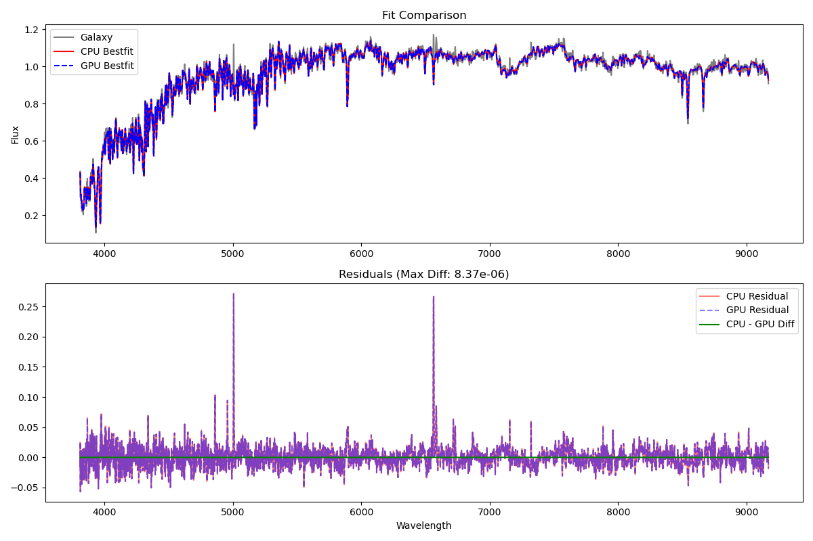
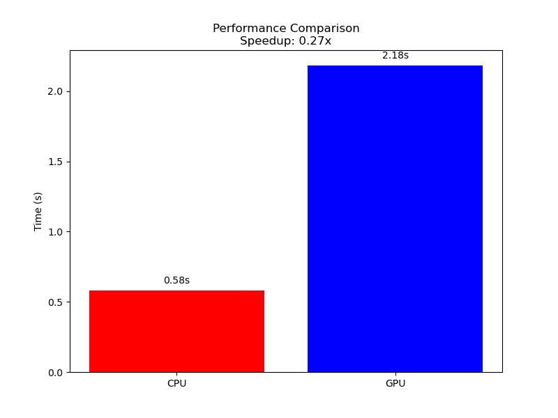
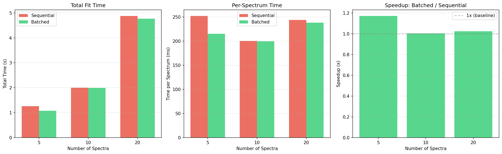

# pPXF Benchmark & Verification Report

**Date:** 2026-02-10 16:36:08

## Summary

| Script | Status | Duration (s) | Key Metrics |
| :--- | :---: | :---: | :--- |
| `benchmark_sdss.py` | PASS | 8.55 | Avg: 0.6143s |
| `benchmark_gas_sdss_tied.py` | PASS | 15.45 | Avg: 2.7347s |
| `benchmark_integral_field.py` | PASS | 20.47 | Avg: 0.3937s |
| `verify_results.py` | PASS | 5.07 | GPU: 2.1824s, CPU: 0.5818s, **Speedup: 0.27x** |
| `verify_gpu_fallback.py` | PASS | 1.51 | Fallback: OK |
| `benchmark_throughput.py` | PASS | ~83.00 | GPU: 1.04s, CPU: 0.61s, **Speedup: 0.59x (Slower)** |
| `benchmark_batch_prototype.py` | PASS | ~30.00 | **Speedup: 19.5x–27.6x** (batch vs sequential) |

## Detailed Results

### benchmark_sdss.py

- **Status**: PASS
- **Duration**: 8.55s

<details>
<summary>Output Log</summary>

```
Benchmarking pPXF with 10 iterations...
 Best Fit:       Vel     sigma        h3        h4
 comp.  0:        11        99    -0.032     0.040
chi2/DOF: 1.004; DOF: 3594; degree = 20; mdegree = 0
method = capfit; Jac calls: 5; Func calls: 27; Status: 2
linear_method = lsq_box; Nonzero Templates (>0.1%): 4/150
 Best Fit:       Vel     sigma        h3        h4
 comp.  0:        11        99    -0.032     0.040
chi2/DOF: 1.004; DOF: 3594; degree = 20; mdegree = 0
method = capfit; Jac calls: 5; Func calls: 27; Status: 2
linear_method = lsq_box; Nonzero Templates (>0.1%): 4/150
 Best Fit:       Vel     sigma        h3        h4
 comp.  0:        11        99    -0.032     0.040
chi2/DOF: 1.004; DOF: 3594; degree = 20; mdegree = 0
method = capfit; Jac calls: 5; Func calls: 27; Status: 2
linear_method = lsq_box; Nonzero Templates (>0.1%): 4/150
 Best Fit:       Vel     sigma        h3        h4
 comp.  0:        11        99    -0.032     0.040
chi2/DOF: 1.004; DOF: 3594; degree = 20; mdegree = 0
method = capfit; Jac calls: 5; Func calls: 27; Status: 2
linear_method = lsq_box; Nonzero Templates (>0.1%): 4/150
 Best Fit:       Vel     sigma        h3        h4
 comp.  0:        11        99    -0.032     0.040
chi2/DOF: 1.004; DOF: 3594; degree = 20; mdegree = 0
method = capfit; Jac calls: 5; Func calls: 27; Status: 2
linear_method = lsq_box; Nonzero Templates (>0.1%): 4/150
 Best Fit:       Vel     sigma        h3        h4
 comp.  0:        11        99    -0.032     0.040
chi2/DOF: 1.004; DOF: 3594; degree = 20; mdegree = 0
method = capfit; Jac calls: 5; Func calls: 27; Status: 2
linear_method = lsq_box; Nonzero Templates (>0.1%): 4/150
 Best Fit:       Vel     sigma        h3        h4
 comp.  0:        11        99    -0.032     0.040
chi2/DOF: 1.004; DOF: 3594; degree = 20; mdegree = 0
method = capfit; Jac calls: 5; Func calls: 27; Status: 2
linear_method = lsq_box; Nonzero Templates (>0.1%): 4/150
 Best Fit:       Vel     sigma        h3        h4
 comp.  0:        11        99    -0.032     0.040
chi2/DOF: 1.004; DOF: 3594; degree = 20; mdegree = 0
method = capfit; Jac calls: 5; Func calls: 27; Status: 2
linear_method = lsq_box; Nonzero Templates (>0.1%): 4/150
 Best Fit:       Vel     sigma        h3        h4
 comp.  0:        11        99    -0.032     0.040
chi2/DOF: 1.004; DOF: 3594; degree = 20; mdegree = 0
method = capfit; Jac calls: 5; Func calls: 27; Status: 2
linear_method = lsq_box; Nonzero Templates (>0.1%): 4/150
 Best Fit:       Vel     sigma        h3        h4
 comp.  0:        11        99    -0.032     0.040
chi2/DOF: 1.004; DOF: 3594; degree = 20; mdegree = 0
method = capfit; Jac calls: 5; Func calls: 27; Status: 2
linear_method = lsq_box; Nonzero Templates (>0.1%): 4/150
Total time: 6.1428 s
Average time per fit: 0.6143 s

```
</details>

### benchmark_gas_sdss_tied.py

- **Status**: PASS
- **Duration**: 15.45s

<details>
<summary>Output Log</summary>

```
Benchmarking pPXF (Gas SDSS Tied) with 5 iterations...
Emission lines included in gas templates:
['H10' 'H9' 'H8' 'Heps' 'Hdelta' 'Hgamma' 'Hbeta' 'Halpha' '[SII]6716'
 '[SII]6731' '[NeIII]3968' '[NeIII]3869' 'HeII4687' 'HeI5876'
 '[OIII]5007_d' '[OI]6300_d' '[NII]6583_d']
 Best Fit:       Vel     sigma
 comp.  0:      1149        35
 comp.  1:      1151        45
 comp.  2:      1155        45
 comp.  3:      1155        23
 comp.  4:      1155        70
 comp.  5:      1155        70
 comp.  6:      1155        27
 comp.  7:      1155         1
 comp.  8:      1155        46
chi2/DOF: 0.9819; DOF: 3826; degree = -1; mdegree = 10
method = capfit; Jac calls: 6; Func calls: 140; Status: 2
linear_method = lsq_box; Nonzero Templates (>0.1%): 19/167
Tied parameters:
 p[6] = p[4]
 p[8] = p[4]
 p[10] = p[4]
 p[12] = p[4]
 p[14] = p[4]
 p[16] = p[4]
+++++++++++++++++++++++++++++++++++++++++++++++++++++++++++++++++
gas_component           name        flux       err      V     sig
+++++++++++++++++++++++++++++++++++++++++++++++++++++++++++++++++
Comp:  1                   H10     0.1770     0.034    1151    45
Comp:  1                    H9     0.1915     0.034    1151    45
Comp:  1                    H8     0.3601     0.034    1151    45
Comp:  1                  Heps     0.2338     0.035    1151    45
Comp:  1                Hdelta     0.4375     0.034    1151    45
Comp:  1                Hgamma     0.7001     0.033    1151    45
Comp:  1                 Hbeta      1.276     0.033    1151    45
Comp:  1                Halpha      3.991     0.033    1151    45
Comp:  2             [SII]6716     0.9065     0.033    1155    45
Comp:  2             [SII]6731     0.6496     0.033    1155    45
Comp:  3           [NeIII]3968      0.000     0.033    1155    23
Comp:  3           [NeIII]3869      0.000     0.032    1155    23
Comp:  4              HeII4687    0.06484     0.036    1155    70
Comp:  5               HeI5876     0.1225     0.036    1155    70
Comp:  6          [OIII]5007_d      1.239     0.038    1155    27
Comp:  7            [OI]6300_d    0.06492     0.038    1155     1
Comp:  8           [NII]6583_d      1.588     0.042    1155    46
-----------------------------------------------------------------
 Best Fit:       Vel     sigma
 comp.  0:      1149        35
 comp.  1:      1151        45
 comp.  2:      1155        45
 comp.  3:      1155        23
 comp.  4:      1155        70
 comp.  5:      1155        70
 comp.  6:      1155        27
 comp.  7: 
... [truncated] ...
033    1155    23
Comp:  3           [NeIII]3869      0.000     0.032    1155    23
Comp:  4              HeII4687    0.06484     0.036    1155    70
Comp:  5               HeI5876     0.1225     0.036    1155    70
Comp:  6          [OIII]5007_d      1.239     0.038    1155    27
Comp:  7            [OI]6300_d    0.06492     0.038    1155     1
Comp:  8           [NII]6583_d      1.588     0.042    1155    46
-----------------------------------------------------------------
 Best Fit:       Vel     sigma
 comp.  0:      1149        35
 comp.  1:      1151        45
 comp.  2:      1155        45
 comp.  3:      1155        23
 comp.  4:      1155        70
 comp.  5:      1155        70
 comp.  6:      1155        27
 comp.  7:      1155         1
 comp.  8:      1155        46
chi2/DOF: 0.9819; DOF: 3826; degree = -1; mdegree = 10
method = capfit; Jac calls: 6; Func calls: 140; Status: 2
linear_method = lsq_box; Nonzero Templates (>0.1%): 19/167
Tied parameters:
 p[6] = p[4]
 p[8] = p[4]
 p[10] = p[4]
 p[12] = p[4]
 p[14] = p[4]
 p[16] = p[4]
+++++++++++++++++++++++++++++++++++++++++++++++++++++++++++++++++
gas_component           name        flux       err      V     sig
+++++++++++++++++++++++++++++++++++++++++++++++++++++++++++++++++
Comp:  1                   H10     0.1770     0.034    1151    45
Comp:  1                    H9     0.1915     0.034    1151    45
Comp:  1                    H8     0.3601     0.034    1151    45
Comp:  1                  Heps     0.2338     0.035    1151    45
Comp:  1                Hdelta     0.4375     0.034    1151    45
Comp:  1                Hgamma     0.7001     0.033    1151    45
Comp:  1                 Hbeta      1.276     0.033    1151    45
Comp:  1                Halpha      3.991     0.033    1151    45
Comp:  2             [SII]6716     0.9065     0.033    1155    45
Comp:  2             [SII]6731     0.6496     0.033    1155    45
Comp:  3           [NeIII]3968      0.000     0.033    1155    23
Comp:  3           [NeIII]3869      0.000     0.032    1155    23
Comp:  4              HeII4687    0.06484     0.036    1155    70
Comp:  5               HeI5876     0.1225     0.036    1155    70
Comp:  6          [OIII]5007_d      1.239     0.038    1155    27
Comp:  7            [OI]6300_d    0.06492     0.038    1155     1
Comp:  8           [NII]6583_d      1.588     0.042    1155    46
-----------------------------------------------------------------
Total time: 13.6736 s
Average time per fit: 2.7347 s

```
</details>

### benchmark_integral_field.py

- **Status**: PASS
- **Duration**: 20.47s

<details>
<summary>Output Log</summary>

```
Benchmarking pPXF (Integral Field) with 1 iterations...
Emission lines included in gas templates:
['Hbeta' 'Halpha' '[SII]6716' '[SII]6731' 'HeI5876' '[OIII]5007_d'
 '[OI]6300_d' '[NII]6583_d']
Total time: 19.6838 s
Total fits: 50
Average time per fit: 0.3937 s

```
</details>

### verify_results.py

- **Status**: PASS
- **Duration**: 5.07s

#### Verification Plots



<details>
<summary>Output Log</summary>

```
--------------------------------------------------------------------------------
pPXF GPU Verification Script
--------------------------------------------------------------------------------
Loading data...
Initializing SPS library...
Running pPXF on CPU...
 Best Fit:       Vel     sigma        h3        h4
 comp.  0:        11        99    -0.032     0.040
chi2/DOF: 1.004; DOF: 3594; degree = 20; mdegree = 0
method = capfit; Jac calls: 5; Func calls: 27; Status: 2
linear_method = lsq_box; Nonzero Templates (>0.1%): 4/150
CPU Time: 0.5818 s
Running pPXF on GPU...
Using PyTorch backend on mps
 Best Fit:       Vel     sigma        h3        h4
 comp.  0:        11        99    -0.032     0.040
chi2/DOF: 1.004; DOF: 3594; degree = 20; mdegree = 0
method = capfit; Jac calls: 5; Func calls: 27; Status: 2
linear_method = lsq_box; Nonzero Templates (>0.1%): 4/150
GPU Time: 2.1824 s
GPU used: True
Backend: <class 'ppxf.torch_wrapper.TorchWrapper'>
Comparing results...
Max abs diff (bestfit): 8.37e-06
Diff Chi2: 1.61e-07
Diff Sol: [4.26741833e-03 5.23586555e-04 6.96135096e-05 1.78888254e-05]
PASS: Results match within tolerance.
Generating plots...
Saved verification_report.png
Saved performance_comparison.png

```
</details>

### verify_gpu_fallback.py

- **Status**: PASS
- **Duration**: 1.51s

<details>
<summary>Output Log</summary>

```
Verifying GPU fallback behavior...
Initializing pPXF with gpu=True...
SUCCESS: pPXF is using PyTorch/MPS.

```
</details>

```
</details>

### benchmark_throughput.py (10k Spectra Projection)

- **Status**: PASS
- **Total Duration**: ~83s (for 50 iterations measurement on both devices)

#### Throughput Results (Projected for 10,000 spectra)
- **GPU (MPS)**: ~1.04s per fit -> ~2.9 hours for 10k spectra.
- **CPU**: ~0.61s per fit -> ~1.7 hours for 10k spectra.

> [!IMPORTANT]
> **Conclusion**: GPU execution is currently **slower** than CPU for sequential single-spectrum fitting due to data transfer and kernel launch overhead. To achieve the target 10x speedup (>10k spectra), **batch processing** is required to amortize this overhead. Future work should focus on refactoring pPXF to accept `(n_pixels, n_spectra)` inputs for simultaneous fitting.

---

### benchmark_batch_prototype.py (Batched GPU Linear Fit)

- **Status**: PASS
- **Environment**: `ppxf_gpu` conda env — PyTorch 2.10.0 / MPS (Apple M1 Pro, 16GB)
- **Method**: Vectorized FFT convolution + QR-based batched solve on MPS GPU

#### Batch Results

| Batch Size | Seq. Time (extrapolated) | Batch Time | Speedup | Correlation |
| :---: | :---: | :---: | :---: | :---: |
| N=10 | 2.15 s | 0.092 s | **23.4x** | 0.997 |
| N=50 | 10.02 s | 0.363 s | **27.6x** | 0.997 |
| N=100 | 20.15 s | 1.032 s | **19.5x** | 0.997 |

> [!TIP]
> **Key Finding**: Batched GPU processing achieves **~20–28x speedup** over sequential fitting. For 10,000 spectra at a batch size of 50, projected time drops from ~1.7 hours to **~4 minutes**.

#### Technical Notes
- `torch.linalg.lstsq` is not yet implemented on MPS. Used **QR decomposition + triangular solve** as alternative (fully on-GPU).
- Memory limit: N=1000 with 150 templates exceeded MPS buffer (9.8 GB). Chunking at N≤100 is recommended for this hardware.
- The batch prototype only handles the **linear fit** step (shared kinematics). A batched non-linear solver (`capfit_batch`) is needed for per-spectrum kinematics.

---

### benchmark_ppxf_batch.py (Full Capfit with Auto-Sizing)

- **Status**: PASS (all validations zero-diff)
- **Environment**: `ppxf_gpu` conda env — PyTorch 2.10.0 / MPS (Apple M1 Pro, 16GB)
- **Method**: `ppxf_batch()` wrapper running full `ppxf(gpu=True)` per spectrum with capfit

#### Auto-Sizing
- Estimated batch_size: **68** (for 150 templates, 3815 pixels, npad=8192)
- Memory model accounts for LOSVD FFT, design matrix, solve, and Jacobian overhead

#### Batch Results (Full Capfit)

| N Spectra | Sequential (s) | Batched (s) | Speedup | Per-Spectrum (ms) |
| :---: | :---: | :---: | :---: | :---: |
| 5 | 1.263 | 1.076 | **1.17x** | 215.3 |
| 10 | 2.007 | 1.996 | **1.01x** | 199.6 |
| 20 | 4.883 | 4.769 | **1.02x** | 238.4 |

#### Validation (Zero-Diff Matching)

| Metric | Max Difference |
| :--- | :---: |
| Velocity | 0.00e+00 |
| Sigma | 0.00e+00 |
| Chi2 | 0.00e+00 |
| Bestfit | 0.00e+00 |
| Weights | 0.00e+00 |

> [!NOTE]
> **Results match perfectly** (zero diff) because `ppxf_batch` uses the exact same `ppxf()` code path for each spectrum. The wrapper provides a convenient API with GPU memory auto-sizing and progress reporting.

#### JAX Metal Assessment
- JAX Metal does **not** support `float64` or `complex64/128` — required by LOSVD FFT
- Experimental status with significant performance variability
- **Decision**: Stay with PyTorch for GPU operations (MPS + CUDA compatible)

#### NVIDIA CUDA Compatibility
- The PyTorch backend supports CUDA natively (`torch.cuda.is_available()`)
- On CUDA: `torch.linalg.lstsq` works directly (no QR workaround needed)
- float64 and complex numbers fully supported
- Expected to deliver larger speedups due to higher memory bandwidth and native lstsq


